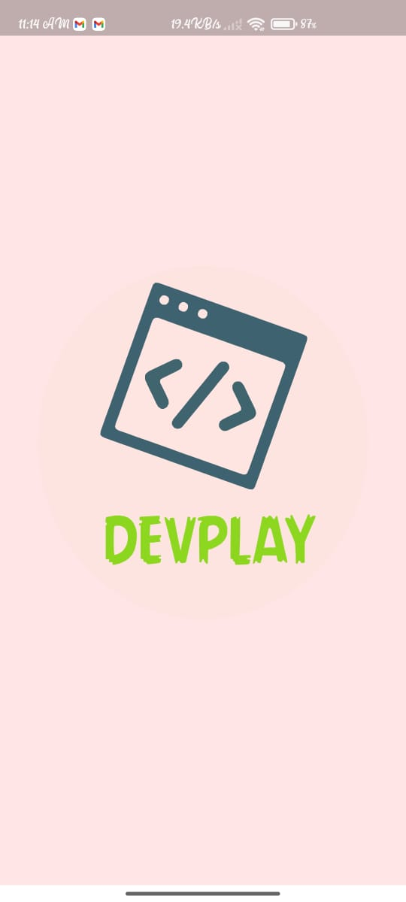
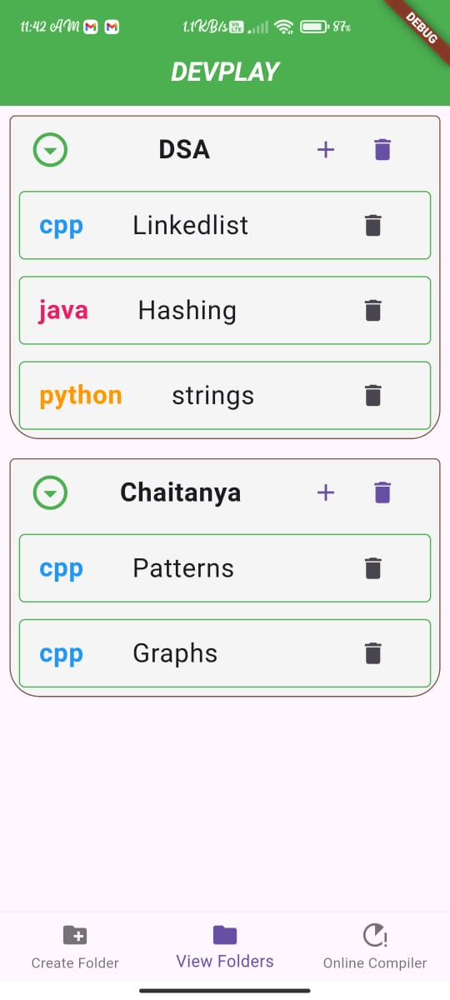
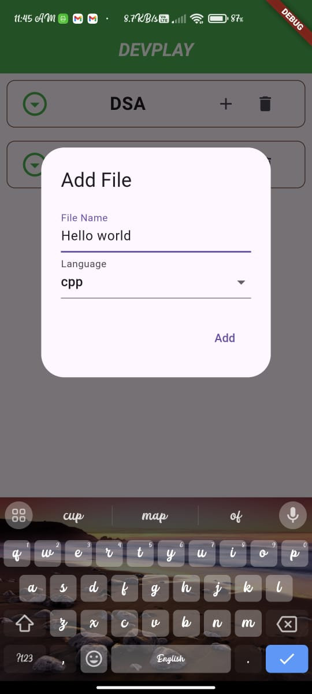
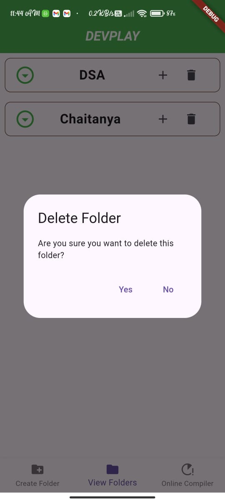
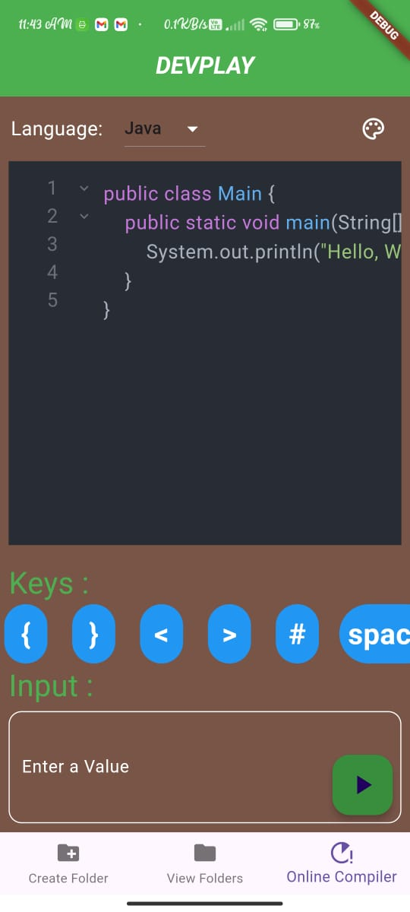
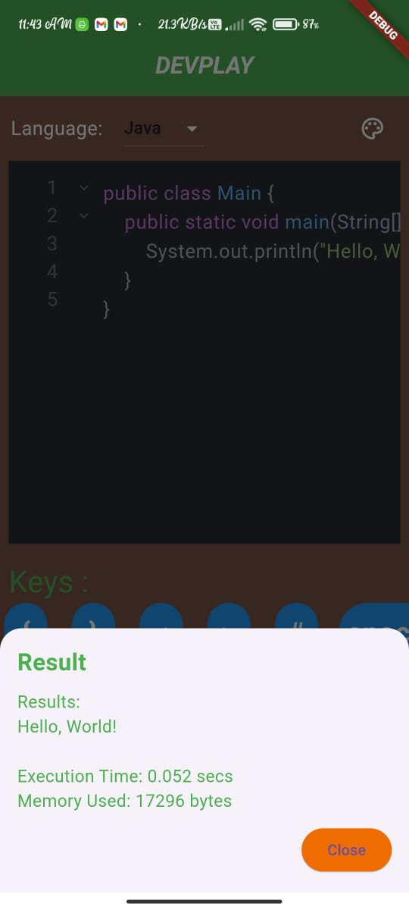

# DevPlaY
DevPlay is an Flutter-based Mobile Application that  helps EndUsers to create folders and files to save the code.
DevPlay Compiler Supports C++,java and Python.
It offers built-in code compilation and execution, making it a handy tool for developers to test code snippets on the go.
## Features

- **Organize Folders:** Create and manage folders and files for your code.
- **Multi-language Support:** Write and compile code in C++, Java, and Python.
- **Real-time Compilation:** Compile and view results directly within the app.

## Screenshots

*This is the SplashScreen.*




*Manage and view folder contents.*




*Create and manage folders.*




*Delete Your Folders.*




*Compiler to run code.*



*View real-time compilation results.*





## Quick Start

Follow these steps to clone the repository, Please add your API key, and run the app:

1. **Clone the Repository:**
   ```bash
   git clone https://github.com/yourusername/devplay.git
   cd devplay
2. **Run below Commands:>>
   ```bash
   pub clean
   fultter pub get
3. **Add YouR API Key**
     create a .env file and add your api key into variable named API_KEY
4. **Run Your Project:**
    ```bash
    flutter run
   
## Contact
    For support or inquiries, contact chalumuribrahmendra@gmail.com.
